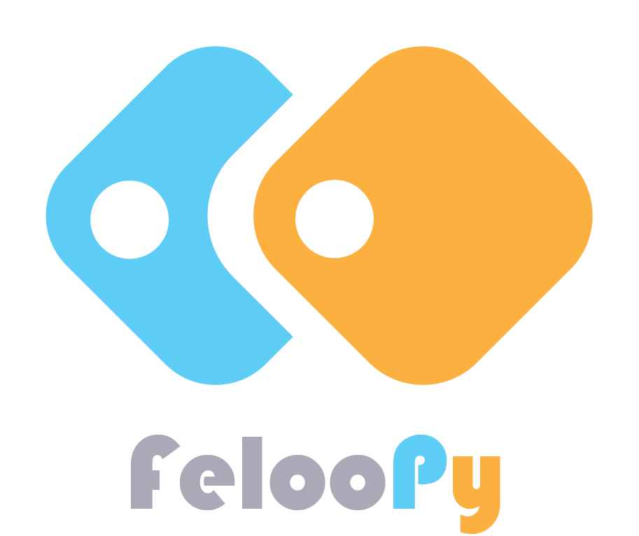

### **Introduction**

| FelooPy                                            | [](https://github.com/ktafakkori/feloopy/releases) [](https://pepy.tech/project/feloopy)  [](https://pepy.tech/project/feloopy) [](https://opensource.org/licenses/MIT) |
| :------------------------------------------------- | :--------------------------------------------------------------------------------------------------------------------------------------------------------------------------------------------------------------------------------------------------------------------------------------------------------------------------------------------------------------------------------------------------------------------------------------------------------------------------------------------------------------------------------------------------------------------------------------------------------------------------------------------------------------------------------------------------------------------------------------------------------------------- |
|  | FelooPy (pronounced /fɛlupaɪ/) is a free and open-source Python library for automated operations research. It serves as both a hyper-optimization interface and an integrated optimization environment. The name comes from the idea of suggesting practical and applicable solutions for systems, industries, and supply chains. It also references the importance of loops in programming and algorithm development, and draws similarities to the name "Floppy" to highlight memory efficiency. FelooPy helps operations research scientists achieve their goals using various target, representor, and learner models, shifting their focus from coding to modeling and analytics.   |

### **Features**

* Simplest universal optimization programming language based on Python for exact, heuristic, and constraint optimization.

<table>
<tr>
<td> Exact optimization </td> <td> Heuristic optimization </td> <td> Constraint optimization </td>
</tr>
<tr>
<td>

```python
from feloopy import *
m = model('exact', 'simple_problem', <interface>)
x = m.pvar('x')
y = m.ivar('y')
m.obj(2*x+5*y)
m.con(5*x+3*y <= 10)
m.con(2*x+7*y <= 9)
m.sol(['max'], <solver>)
m.report()
m.dis(x,y)
```

</td>
<td>
    
```python
from feloopy import *
def instance(X):
    m = model('heuristic', 'simple_problem', <interface>, X)
    x = m.pvar('x',variable_bound=[0,10])
    y = m.ivar('y',variable_bound=[0,10])
    m.obj(2*x+5*y)
    m.con(5*x+3*y |l| 10)
    m.con(2*x+7*y |l| 9)
    m.sol(['max'], <solver>)
    return m[X]
m = implement(instance)
m.sol(penalty_coefficient=300)
m.report()
m.dis(['x'])
m.dis(['y'])
```
</td>

<td>
    
```python
from feloopy import *
m = model('constraint', 'simple_problem', <interface>)
x = m.ivar('x')
y = m.ivar('y')
m.obj(m.plus(2*x,5*y))
m.con(m.plus(5*x,3*y) <= 10)
m.con(m.plus(2*x,7*y)<= 9)
m.sol(['max'], <solver>)
m.report()
m.dis(x,y)
```
</td>
</tr>
</table>

* Supporting 17 exact, constraint, and heuristic optimization interfaces and solvers, just by changing two parameters, `<interface>` and `<solver>`, in the above examples.


* Supporting benchmarking with verios interfaces and solvers. 

<table>
<tr>
<td> Exact optimization </td> <td> Heuristic optimization </td> <td> Constraint optimization </td>
</tr>
<tr>
<td>

```python
from feloopy import *
m = model('exact', 'simple_problem', <interface>)
x = m.pvar('x')
y = m.ivar('y')
m.obj(2*x+5*y)
m.con(5*x+3*y <= 10)
m.con(2*x+7*y <= 9)
m.sol(['max'], <solver>)
m.report()
m.dis(x,y)
```

</td>

</tr>
</table>


### **Installation**

FelooPy and its dependencies should work on Linux-based distributions, Windows, or macOS. To install this Python library, you might follow one of the following methods. Note that the installed Python compiler version should be greater than or equal to 3.10.

<div align="center">

<table>
<tr>
<td> Method </td> <td> Description </td> <td> Requirements </td>
</tr>

<tr>
<td> Quick </td>
<td>
    
`pip install --upgrade feloopy`
</td>
<td> Python >= 3.10 </td>
</tr>


<tr>
<td> PyPI </td>
<td>
    
`pip install feloopy==0.2.4`
</td>
<td> Python >= 3.10 </td>
</tr>

<tr>
<td> Command </td>
<td>
    
`!pip install feloopy==0.2.4`
</td>
<td> Python >= 3.10 </td>
</tr>

<tr>
<td> Script </td>
<td>
    
```python
import pip

def install(package):
    if hasattr(pip, 'main'):
        pip.main(['install','-U', package])
    else:
        pip._internal.main(['install','-U', package])

install('feloopy')
```
</td>
<td> Python >= 3.10 </td>
</tr>

<tr>
<td> Local </td>
<td>
    
1. Download the [feloopy-0.2.4.zip][c] file.
2. Extract it into a specific directory.
3. Open a terminal in that directory.
4. Type: `pip install .`

</td>

<td> Python >= 3.10 </td>

</tr>

<tr>
<td> Colab </td>
<td>

1. Run this cell and reload (CTRL + R) (using `"py310"` or `"py311"`):

```python
!wget https://github.com/korakot/kora/releases/download/v0.10/py310.sh
!bash ./py310.sh -b -f -p /usr/local
!python -m ipykernel install --name "py310" --user
```

2. Run this cell and reload (CTRL + R):

```python
!pip install feloopy==0.2.4
```

</td>

<td> Python >= 3.10 </td>

</tr>

<tr>
<td> Git </td>
<td>
    
`pip install -U git+https://github.com/ktafakkori/feloopy`
</td>

<td> Python >= 3.10 </td>

</tr>

</table>

</div>

### **Supporters**

[](https://github.com/ktafakkori/feloopy/stargazers)

[](https://github.com/ktafakkori/feloopy/network/members)

[c]: https://github.com/ktafakkori/feloopy/releases